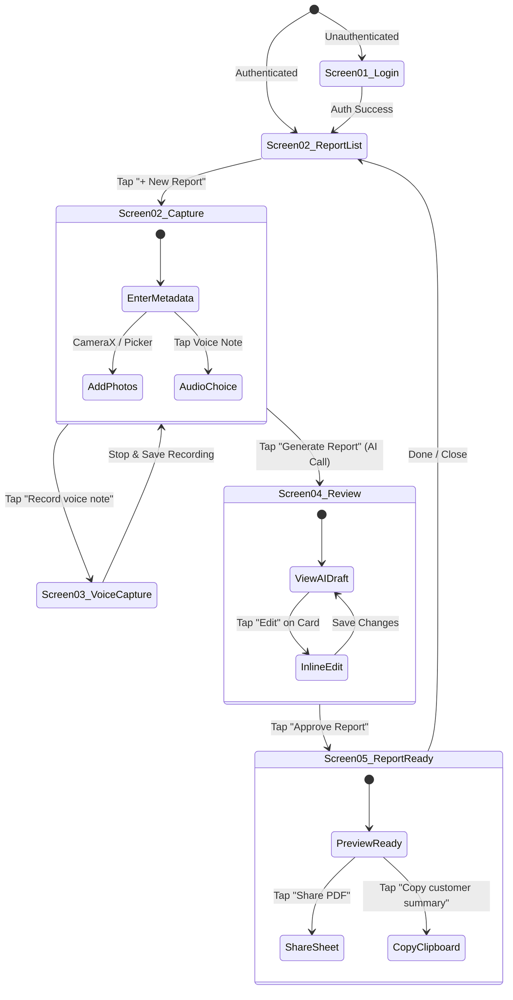

# UX Experience & Interaction Specification (`EXPERIENCE.md`) — Field Report AI

**Document Version:** 1.0.0  
**Target Platform:** Android (Jetpack Compose, MVVM)  
**Status:** Approved for Implementation  
**Output Location:** `_bmad-output/planning-artifacts/EXPERIENCE.md`  
**Companion Document:** [`DESIGN.md`](file:///Users/arminmehran/dev/field-report-ai/_bmad-output/planning-artifacts/DESIGN.md)

---

## 1. Field Usability & Ergonomic Principles

Technicians typically use this app under adverse physical conditions: inside tight utility closets, in unlit basements, on windy roofs, or sitting inside a truck cab between calls.

### Core Interaction Rules
1. **The "Thumb-Zone" First Rule:** All primary action buttons (`"Generate report"`, `"Approve report"`, `"Share PDF"`, Record Mic, Stop) are positioned within the bottom 30% of the viewport (the natural ergonomic thumb arc).
2. **Haptic Assurance:** When operating in noisy environments where audio cues are missed, tactile feedback confirms critical state changes:
   * **Recording Start:** Sharp 50ms tick vibration (`VibrationEffect.createPredefined(EFFECT_CLICK)`).
   * **Recording Stop:** Dual confirmation tick (`50ms on / 30ms off / 50ms on`).
   * **Generation Complete:** Smooth success ramp vibration.
   * **Approval / Sign-off:** Heavy impact click (`EFFECT_HEAVY_CLICK`).
3. **Screen Wake-Lock During Recording:** When audio capture is active, the screen must hold a `FLAG_KEEP_SCREEN_ON` to prevent accidental OS display dimming or device locking.
4. **No Discard by Accident:** Swiping away or hitting Back during an active draft or recording never discards data without an explicit confirmation dialog.

---

## 2. Navigation Architecture & Screen State Machine

---

## 3. Screen Interaction Details

### 3.1 Screen 01: Login & Onboarding
* **Initial State:** Clean form with email, password, and Google Sign-in.
* **Loading State:** CircularProgressIndicator inside the primary "Continue" button; fields disabled to prevent duplicate submissions.
* **Error State:** High-contrast snackbar or red inline error text (e.g., *"Invalid email or password. Please try again."*).
* **First-Time User Onboarding:** Immediate lightweight dialog asking for **Business Name** and **Primary Trade** (HVAC, Electrical, Plumbing, Painting, Handyman) before dropping the user directly into the main job list. Zero multi-step tutorials.

### 3.2 Screen 02: New Report (Capture Hub)
* **Customer/Job Field:**
  * Auto-focused on screen open with soft keyboard.
  * Suggests recent customer names if matched.
* **Photo Handling Interaction:**
  * Tapping `"Add photo"` opens a quick bottom sheet: `Take photo with Camera` or `Select from Gallery`.
  * Thumbnails render immediately upon capture.
  * Single tap on thumbnail allows toggling badge: `[Before] ➔ [After] ➔ [General]`.
  * Long-press on thumbnail displays a trash icon overlay with haptic tick to remove photo.
* **Audio / Notes Toggle:**
  * Large distinct card for Voice Note.
  * A small subtle text link below: `"or type notes instead"` switches the container to an inline multi-line text field (`OutlinedTextField`) without leaving the screen.
* **Generate Button State:**
  * Disabled (50% opacity) if Customer Name is empty OR if both Audio and Notes are missing.
  * Active (100% solid dark charcoal) once minimum criteria are satisfied.

### 3.3 Screen 03: Voice Capture Screen
* **Opening Sequence:** Transitions with a smooth fade-in. Audio recording begins automatically within 200ms of entering screen.
* **Live Waveform:** Real-time visual feedback mapped to decibel amplitude. Reassures the user that their voice is actually being registered.
* **Timer Dynamics:**
  * Count-up timer formatted as `MM:SS`.
  * Green ring from `00:00` to `01:30`.
  * Turns Amber at `01:15` (warning of 90s recommended maximum).
  * Automatically stops and saves when hitting the 2-minute hard limit.
* **Stop Action:** Tapping the large red square stops capture, releases audio hardware, saves `.m4a` file to local cache, and returns to Screen 02 with the audio note badge marked `"Recorded (0:28)"`.

### 3.4 Screen 04: AI Review & Human-in-the-Loop Gate
* **Loading / Generation State (When transitioning from Screen 02):**
  * Displays an engaging, honest progress screen:
    * *"Transcribing your voice note..."* (0–3s)
    * *"Structuring work completed and observations..."* (3–8s)
    * *"Applying trade vocabulary..."* (8–12s)
  * Cancel option available at any time to fallback to manual editing.
* **The Review Interface:**
  * Top alert bar: `AI DRAFT — REVIEW REQUIRED` remains pinned until the user approves.
  * Each card (`Work completed`, `Findings`, `Recommended next steps`) has an `"Edit"` button.
  * **Inline Editing Behavior:**
    * Tapping `"Edit"` transforms the card text into an active text field with a visible checkmark icon (`✓ Done`).
    * Cursor automatically placed at end of text.
    * Allows quick deletion of inaccurate bullet points or fast voice-typing corrections.
  * **View Raw Transcript:** An expandable link at bottom: `Show raw transcript` displays the unedited speech transcription for instant reference if anything feels missing.
* **The Approval Gate:**
  * Tapping `"Approve report"` triggers a distinct heavy haptic click, permanently updates report status to `approved`, and navigates forward.

### 3.5 Screen 05: Report Ready & Sharing
* **Celebration & Confidence:**
  * Success checkmark bounces in (`spring` spec animation).
  * Clear visual summary of the customer report.
* **Share Actions:**
  * **Primary Action ("Share PDF"):**
    * Triggers client-side `PdfDocument` generation in < 500ms.
    * Opens Android Native Sharesheet via `FileProvider` (`content://...`).
    * Pre-selects common apps (WhatsApp, Gmail, Messages, Drive).
  * **Secondary Action ("Copy customer summary"):**
    * Copies a polite, formatted plain-text message to the Android clipboard:
      > *"Hi [Customer], here is a summary of the completed work at [Address] on [Date]. Total [X] photos attached. [Customer Summary] - Northline Home Services"*
    * Displays a brief toast: *"Customer summary copied to clipboard"*.

---

## 4. Offline & Network Degradation Matrix

| Scenario | System State | User Experience & UI Messaging |
| :--- | :--- | :--- |
| **No Internet during Photo/Voice Capture** | Offline Mode | App works with 100% functionality. Photos and audio save locally to Room and app private cache. |
| **User taps "Generate Report" while Offline** | `draft_waiting_online` | Dialog: *"You're offline. We saved your draft locally. We'll automatically generate your report as soon as you reconnect, or you can edit manually."* |
| **App killed by OS during Generation** | Resumable Work | WorkManager detects pending generation job upon app re-opening. Notifies user via notification or in-app snackbar: *"Your report for Miller Residence is ready for review."* |
| **AI Generation Timeout (> 45s)** | Graceful Fallback | Error state with two clear buttons: `[Retry Generation]` or `[Create Manual Report]`. The raw transcript is dumped into the editor so no contractor thoughts are lost. |
| **Corrupted / Inaudible Voice Note** | Quality Alert | Generation succeeds with a warning chip: *"Audio was muffled near 0:15. Please double check the Work Completed section."* |

---

## 5. Accessibility & Field Comfort Standards

* **Touch Targets:** All primary interactive elements exceed 48x48dp (primary buttons are 56dp height; Stop button is 64x64dp).
* **High Contrast Text:** Minimum contrast ratio of **4.5:1** for all body text and **7:1** for status text, ensuring readability in direct sunlight.
* **Dynamic Font Scaling:** UI layouts use `sp` and flexible column arrangements, ensuring no layout clipping when Android system font size is set to Large or Extra Large (common among trade professionals).
* **Keyboard Handling:** Form screens feature automated `imePadding()` to ensure inputs are never obscured by the virtual keyboard.
