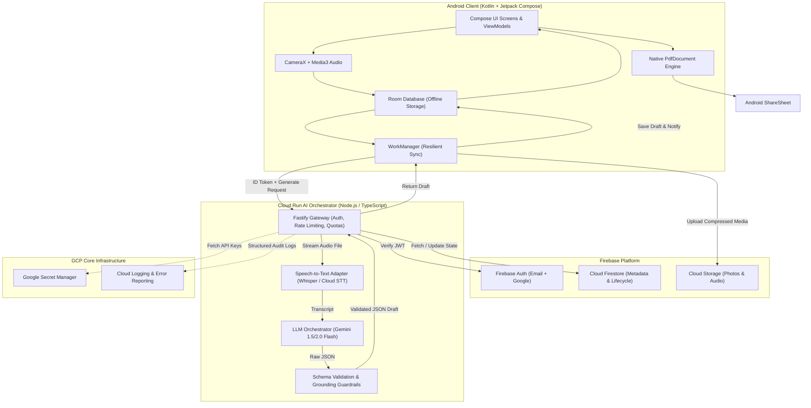
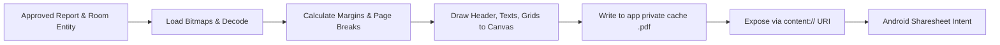

# Technical Architecture Document (`architecture.md`) — Field Report AI

**Document Version:** 1.0.0  
**Status:** Approved for Implementation  
**Target Release:** MVP (Phase 1 Closed Pilot)  
**Author:** Antigravity / BMad Method  
**Output Location:** `_bmad-output/planning-artifacts/architecture.md`  
**Prerequisites:** [`prd.md`](file:///Users/arminmehran/dev/field-report-ai/_bmad-output/planning-artifacts/prd.md), [`DESIGN.md`](file:///Users/arminmehran/dev/field-report-ai/_bmad-output/planning-artifacts/DESIGN.md), [`EXPERIENCE.md`](file:///Users/arminmehran/dev/field-report-ai/_bmad-output/planning-artifacts/EXPERIENCE.md)

---

## 1. System Overview & Technology Topology



### Technology Matrix

| Subsystem | Technology Choice | Version / Library | Rationale |
| :--- | :--- | :--- | :--- |
| **Android OS** | Android SDK | Min SDK: 26 (Android 8.0), Target: 34 (Android 14) | Covers 95%+ of active contractor devices while supporting modern background execution APIs. |
| **Android UI** | Jetpack Compose | Compose BOM `2024.02.00+` / Material 3 | Declarative UI, frictionless reactive state binding, fluid animations, and dark/light support. |
| **Android Architecture** | MVVM + Clean Repository | Kotlin Coroutines + StateFlow | Predictable unidirectional data flow (UDF), testable view models, structured concurrency. |
| **Offline Persistence** | Android Room | Room `2.6.x` with KSP | Type-safe SQLite abstraction, full offline persistence for drafts, zero data loss. |
| **Background Sync** | WorkManager | WorkManager `2.9.x` | Guarantees execution across app restarts, Doze mode, and cellular dropouts with exponential backoff. |
| **Media Capture** | CameraX & Media3 | `androidx.camera:camera-core` + `androidx.media3` | Hardware-agnostic camera control, photo picker integration, and robust low-overhead audio capture. |
| **Client PDF Engine** | Android `PdfDocument` | Native Android SDK API | Zero cloud compute cost, immediate local generation (<500ms), works 100% offline. |
| **Backend Runtime** | Cloud Run (Docker) | Node.js 20 LTS / TypeScript / Fastify | Stateless, sub-second cold starts, scales to zero when idle, simple local container testing. |
| **Auth & Data** | Firebase Platform | Firebase Auth, Firestore, Cloud Storage | Instant enterprise auth, real-time sync, secure path-based storage rules. |
| **LLM Engine** | Google Gemini API | Gemini 1.5 Flash / 2.0 Flash | Ultra-low latency (<2s), high structured JSON compliance, cost-efficient ($0.075/M tokens). |

---

## 2. Trust Boundaries & Security Architecture

### 2.1 Principle of Least Privilege
1. **Zero Client Secrets:** The Android application never bundles, receives, or parses third-party AI provider keys (Gemini, OpenAI, Anthropic).
2. **Per-User Scoped Storage:** Cloud Storage rules enforce strict user-isolated paths:
   ```javascript
   rules_version = '2';
   service firebase.storage {
     match /b/{bucket}/o {
       match /users/{userId}/reports/{reportId}/{allPaths=**} {
         allow read, write: if request.auth != null && request.auth.uid == userId;
       }
     }
   }
   ```
3. **Firestore Security Rules:** Direct client read/write is strictly scoped:
   ```javascript
   rules_version = '2';
   service cloud.firestore {
     match /databases/{database}/documents {
       match /users/{userId} {
         allow read, write: if request.auth != null && request.auth.uid == userId;
       }
       match /reports/{reportId} {
         allow read, write: if request.auth != null && request.auth.uid == resource.data.userId;
         allow create: if request.auth != null && request.auth.uid == request.resource.data.userId;
       }
     }
   }
   ```
4. **Secret Management:** The Cloud Run container loads AI keys at startup from **Google Secret Manager** via IAM service account role (`roles/secretmanager.secretAccessor`).

---

## 3. Cloud Run Orchestration API Contract

The Cloud Run orchestrator exposes a lightweight REST interface running on Fastify.

### 3.1 `POST /v1/reports/generate`
Initiates audio transcription and structured report draft generation.

#### Request Headers
* `Authorization: Bearer <Firebase_ID_Token>`
* `Content-Type: application/json`
* `X-Idempotency-Key: <UUIDv4>` (prevents duplicate billing/generation on retry)

#### Request Body
```json
{
  "reportId": "rep_9f83a2c1",
  "audioStoragePath": "users/usr_4810/reports/rep_9f83a2c1/audio_note.m4a",
  "typedNotes": "Replaced faulty run capacitor on condenser unit. Tested voltage.",
  "primaryTrade": "HVAC",
  "customerName": "Miller Residence",
  "jobTitle": "A/C cooling failure"
}
```

#### Response Body (`200 OK`)
```json
{
  "reportId": "rep_9f83a2c1",
  "status": "needs_review",
  "transcript": "Okay, replaced the faulty run capacitor on the exterior condenser unit. Checked refrigerant pressure and tested operating voltage. System cooling normally now.",
  "draft": {
    "customerSummary": "Inspected the cooling system and restored operation by replacing a failing condenser run capacitor.",
    "workCompleted": [
      "Diagnosed inoperable outdoor condenser unit.",
      "Replaced defective run capacitor with OEM specification part.",
      "Tested electrical voltage and verified normal compressor startup.",
      "Checked operating refrigerant pressures and confirmed supply air temperature drop."
    ],
    "findings": [
      "Outdoor capacitor had failed due to normal wear, preventing compressor operation.",
      "Evaporator coil and outdoor condenser fins show moderate dust accumulation."
    ],
    "recommendations": [
      "Schedule annual spring coil cleaning to maintain energy efficiency.",
      "Replace 16x25x1 furnace air filter within 30 days."
    ],
    "uncertainties": []
  },
  "usage": {
    "audioDurationSeconds": 28,
    "promptTokens": 620,
    "outputTokens": 285,
    "latencyMs": 3450
  }
}
```

#### Error Responses
* `401 Unauthorized`: Invalid or expired Firebase JWT.
* `403 Forbidden`: User quota exceeded for current billing cycle.
* `422 Unprocessable Entity`: Audio file corrupted or unreadable.
* `502 Bad Gateway`: Upstream LLM generation failure (retried internally with backoff).

---

## 4. LLM Prompt Guardrails & Validation Pipeline

### 4.1 Strict Grounding System Prompt
```markdown
You are an expert post-job report assistant for field technicians.
Your goal is to turn messy field notes and spoken words into a clean, professional, non-technical customer report.

CRITICAL RULES:
1. STRICT GROUNDING: Include ONLY facts, actions, and observations explicitly stated in the transcript or notes.
2. ZERO INVENTED LIABILITIES: NEVER invent part numbers, prices, warranties, compliance with building codes, or structural guarantees.
3. UNCERTAINTY HANDLING: If an audio segment is muffled or ambiguous, place a query in the "uncertainties" array instead of guessing.
4. TONE: Write in polite, clear, professional language suitable for a homeowner.
5. FORMAT: You MUST return a single valid JSON object adhering strictly to the provided schema.
```

### 4.2 Zod Schema Validator
```typescript
import { z } from "zod";

export const ReportDraftSchema = z.object({
  customerSummary: z.string().min(10).max(300),
  workCompleted: z.array(z.string().min(5).max(200)).min(1),
  findings: z.array(z.string().min(5).max(200)).default([]),
  recommendations: z.array(z.string().min(5).max(200)).default([]),
  uncertainties: z.array(z.string().min(5).max(150)).default([]),
});

export type ReportDraft = z.infer<typeof ReportDraftSchema>;
```

---

## 5. Android Client Persistence Architecture (Room DB)

### 5.1 Entities

#### `ReportEntity`
```kotlin
@Entity(tableName = "reports")
data class ReportEntity(
    @PrimaryKey val id: String,
    val userId: String,
    val status: ReportStatus, // DRAFT, SYNCING, NEEDS_REVIEW, APPROVED, COMPLETED
    val customerName: String,
    val jobTitle: String,
    val address: String?,
    val referenceNumber: String?,
    val typedNotes: String?,
    val audioLocalUri: String?,
    val audioStoragePath: String?,
    val rawTranscript: String?,
    val customerSummary: String?,
    val workCompletedJson: String?, // Serialized List<String>
    val findingsJson: String?,      // Serialized List<String>
    val recommendationsJson: String?, // Serialized List<String>
    val pdfLocalPath: String?,
    val createdAt: Long,
    val updatedAt: Long,
    val approvedAt: Long?
)
```

#### `MediaItemEntity`
```kotlin
@Entity(
    tableName = "media_items",
    foreignKeys = [
        ForeignKey(
            entity = ReportEntity::class,
            parentColumns = ["id"],
            childColumns = ["reportId"],
            onDelete = ForeignKey.CASCADE
        )
    ],
    indices = [Index("reportId")]
)
data class MediaItemEntity(
    @PrimaryKey val id: String,
    val reportId: String,
    val type: MediaType, // PHOTO, AUDIO
    val label: PhotoLabel, // BEFORE, AFTER, GENERAL
    val localUri: String,
    val storagePath: String?,
    val sortOrder: Int,
    val isUploaded: Boolean
)
```

### 5.2 WorkManager Sync Pipeline (`GenerateReportWorker`)
1. **Constraint Check:** Network connected (`NetworkType.CONNECTED`).
2. **Media Optimization:**
   - Compresses all un-uploaded photos to WebP (1600px max edge, 80% quality, <400KB).
   - Verifies audio format is standard AAC (.m4a, 32kbps mono).
3. **Storage Upload:** Uploads pending items to Cloud Storage in parallel via Kotlin `async/awaitAll`.
4. **API Call:** Sends idempotent POST to Cloud Run `/v1/reports/generate`.
5. **Database Transaction:** Atomically updates `ReportEntity` with returned transcript, structured draft fields, and transitions status to `NEEDS_REVIEW`.
6. **Notification:** Sends local Android notification if app is in background: *"Your report draft is ready for review."*

---

## 6. Client-Side PDF Generation Engine

PDF generation runs entirely on-device using Android `android.graphics.pdf.PdfDocument`.



### Layout Specifications
* **Page Dimensions:** 612 x 792 points (Standard US Letter @ 72 DPI).
* **Color Scheme:** Primary Teal banner `#0F766E`, Charcoal body text `#111827`, Muted gray borders `#E2E8F0`.
* **Bitmap Memory Protection:** Photos are downscaled using `BitmapFactory.Options.inSampleSize` to render precisely at 200x200pt on the canvas, eliminating OutOfMemory (OOM) risks.
* **Pagination Logic:** Measures text bounds with `StaticLayout`. If content overflows page height (792pt - 72pt margins), it cleanly breaks into Page 2.

---

## 7. Observability, Cost & Telemetry Strategy

1. **Per-Report AI Cost Tracking:** Cloud Run logs a structured JSON entry for every generation call:
   ```json
   {
     "severity": "INFO",
     "event": "report_generation_completed",
     "userId": "usr_4810",
     "reportId": "rep_9f83a2c1",
     "sttDurationSec": 28.4,
     "llmModel": "gemini-1.5-flash",
     "promptTokens": 620,
     "outputTokens": 285,
     "estimatedCostUsd": 0.00012,
     "durationMs": 3450
   }
   ```
2. **Quota & Rate Limits:**
   - Free Tier: 3 lifetime reports.
   - Solo Tier: 30 reports/month, max 5 generations/hour (prevents infinite retry abuse).
   - Enforced by Cloud Run checking Firestore user document before dispatching AI requests.
3. **Crash & Error Telemetry:** Firebase Crashlytics enabled on Android client, strictly configured to **scrub and omit** customer names, addresses, photos, and voice transcripts from crash reports.
