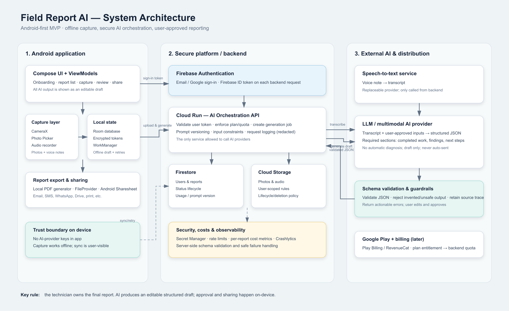

# Field Report AI — System Architecture

## Architecture summary

The Android app handles the fast field workflow: photo/audio capture, offline drafts, report review, local PDF generation, and sharing. It never contains an AI-provider API key.

Firebase provides authentication, report metadata, and protected media storage. A Cloud Run orchestration API validates the signed-in user, controls usage and cost, calls speech/AI providers, validates structured output, and returns only an editable report draft. The technician must approve the report before it can be exported or shared.

## Data flow

1. Technician creates a report, takes photos, and records a voice note.
2. Android saves the draft locally and uploads media when connected.
3. Android authenticates with Firebase and calls the Cloud Run orchestration API.
4. Cloud Run validates the user, plan/quota, media constraints, and request state.
5. Cloud Run obtains a transcript, calls the LLM using a strict structured-output schema, and validates the returned JSON.
6. The app displays the AI draft for user editing and explicit approval.
7. The approved report is turned into a PDF locally and shared with Android's native share sheet.

## Trust boundaries

- Customer photos, voice notes, and report data require authenticated, user-scoped access.
- API/provider secrets are stored server-side only in Secret Manager.
- AI output is never sent automatically and must not assert unsourced diagnoses, compliance status, prices, warranties, or guarantees.
- Offline capture remains local until the user can sync and request generation.

## Suggested MVP services

| Concern | Recommended service |
|---|---|
| Android UI | Kotlin, Jetpack Compose, MVVM |
| Capture | CameraX, Photo Picker, MediaRecorder/Media3 |
| Offline state | Room + WorkManager |
| Authentication | Firebase Authentication |
| Report data | Cloud Firestore |
| Media | Cloud Storage for Firebase |
| AI gateway | Cloud Run (Node.js/TypeScript) |
| Secrets | Google Secret Manager |
| AI | Swappable speech-to-text and structured-output LLM provider |
| Billing later | Google Play Billing / RevenueCat |
